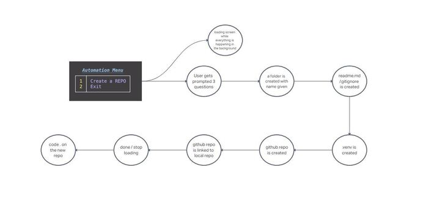
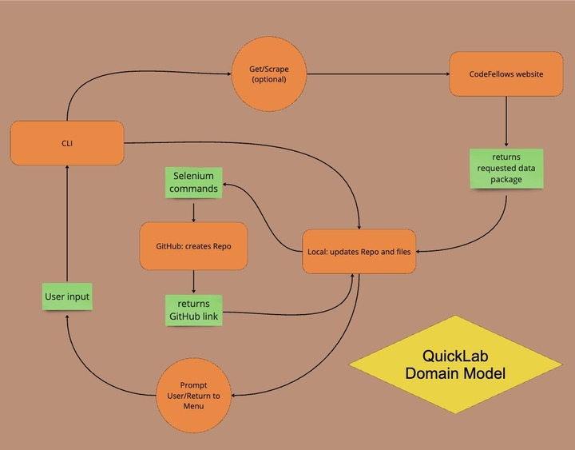

# quick-lab

## Group Members

Kyle Aleman, Johnny Backus, Xin Deng, Brendan Huddleston, Myyela Isaac

### Summary of idea:

Our vision is to develop an intelligent, user-friendly system that streamlines the setup process for lab assignments, ensuring that students can focus on learning rather than the intricacies of environment configuration. By automating the environment setup, we aim to create a seamless, error-free process that adapts to various operating systems and Python versions, guaranteeing that every participant starts from a standardized, fully-prepared platform. This project will not only enhance the efficiency and accessibility of labs but also foster a more inclusive and engaging learning experience by removing technical barriers and allowing students to dive straight into coding.

### What problem or pain point does it solve?

The automated setup for Python labs significantly cuts down the time students spend on manual configurations, ensures a consistent coding environment across various systems, and shifts the focus from technical setup to the core learning of Python. This approach eliminates the technical hurdles and disparities, making coding more accessible and enjoyable for everyone involved. It democratizes the learning process, allowing students to dive straight into coding with a solid, uniform foundation.

### Minimum Viable Product (MVP) definition.

Given a name, at least makes a readme, creates files and folders locally, makes venv.

### Wireframes



### User Stories

1. Trello Board
   [Trello Board](https://trello.com/b/47nPPkMO/401-python-midterm)

1. Create a Repo

   - User Story sentence
     - As a user, I want to create a repo in my class folder with a name that I give it.
   - Feature Tasks
     - given a name, create a folder in the right spot
     - make sure the name is correct and there are no other folders
   - Acceptance Tests
     - Repo is created in the right spot
     - Repo is the correct name
   - Estimate your User Stories: Half day

1. README Creation

   - User Story sentence
     - As a user, I want my Repo to contain a README.md with the lab requirements.
   - Feature Tasks
     - add a readme
     - add content to the readme
   - Acceptance Tests
     - repo has readme
     - readme has the correct content
   - Estimate your User Stories: Half day

1. Virtual Environment

   - User Story sentence
     - As a user, I want to make a virtual environment with a repo.
   - Feature Tasks
     - instantiate a virtual environment for that repo
     - activate the environment
   - Acceptance Tests
     - the virtual env is created
     - the virtual env activated
   - Estimate your User Stories: Half day

1. Github Create

   - User Story sentence
     - As a user I want the script to use my github to create a new github repo given a name.
   - Feature Tasks
     - script makes a repo in github
     - returns the github link, to link the local repo
   - Acceptance Tests
     - github creates a repo with the correct name.
     - a link is returned
   - Estimate your User Stories: One Day

1. Github link

   - User Story sentence
     - As a user, I want to automatically link my local and remote repo
   - Feature Tasks
     - Utilizing Playwright, a new GitHub remote repo will be created under the user’s account with the desired name
     - The script will `git add`, `git commit` and `remote add origin` from the local repo to remote. Linking the two
   - Acceptance Tests
     - Successful remote repo creation
     - Successful commit from local repo
     - Successful linking of the two
   - Estimate your User Stories: One day

### Domain Modeling

```
Draw out the entities for your project and how they are related to each other. Determine the relationships between the functions/methods and entities of your app.

Include in your domain model the names and data types of your entities and their properties.
```

   

<!-- ### Using a Database? Make an Database Schema Diagram ?

If you are using a database of any kind in your project, draft out what your schema will look like by creating a diagram of all your application data models, each in it’s own collection (or table).

Be sure to identify the relationships (if any) between each of your data models:

1. Does a single item in your database “belong to” just one other item in your database? For example, a person has one passport, and a passport belongs to a single person.
1. Does a item in your database “belong to” multiple other items in your database? For example, a house has many residents, and each resident has one primary house.
1. Do many items in your database relate to many other items in your database? For example, a band has many musicians, and a musician can be in many bands.

Also, include for each separate collection:

1. The name of each property stored in the collection.
1. The required data type.
1. An indication if this collection is associated with another collection.

Include this diagram in your readme, accompanied by an explanation of each data model and it’s responsibility in the application. -->
